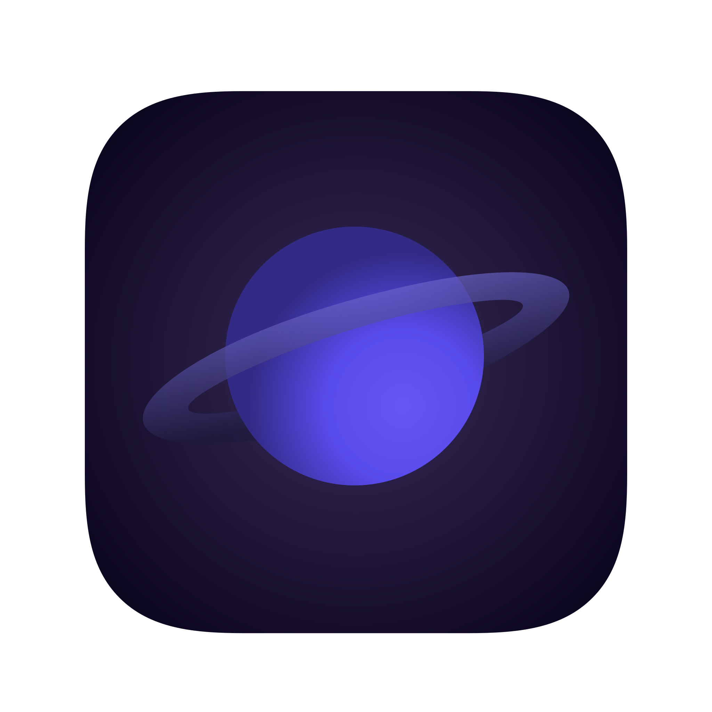

# course-project-team-5
Exam project for the IDATA2301 and IDATA2306 courses

  

## About the project

A simplified price
aggregator web-shop in groups.

The website is currently hosted [here](http://connect.learniverse.store/)

According to:
- Requirements from a customer
- Design guidelines
- Accessibility rules
- Using the best software dev practices: sprints, GIT
- Javascript for interaction and dynamic updates
- Communication with a backend API

An example of such webshop is: https://athotel.com/

## Technologies Used

This project is built using two frameworks, each representing a different side of the web application. The backend is built using Spring Boot, while the frontend is built using Vue.js. Below is a brief description of each of the:

## [Spring Boot](https://spring.io/projects/spring-boot)

Spring Boot makes it easy to create stand-alone, production-grade Spring based Applications that you can "just run". It takes an opinionated view of the Spring platform and third-party libraries so you can get started with minimum fuss.

## [Vue.js](https://vuejs.org/ )

Vue.js is a progressive JavaScript framework for building user interfaces. Unlike other monolithic frameworks, Vue is designed from the ground up to be incrementally adoptable.

## Requirements

### Functional requirements
1. An online web shop with landing page, price
   comparison page, deal and discount information,
   and product filter and search.
2. Application state changes during the lifecycle
   (example: booking a hotel)
3. DOM modification with Javascript
4. At least one REST API request

### Non-functional requirements
1. Responsive design
2. Accessibility principles
3. Aesthetically pleasing
4. Follow a given theme/genre
5. Code stored in Git
6. Agile work in Sprints
7. Reasonable code design and structure

### Possible extras
- Authentication (frontend side)
- Secured site with HTTPS (when on your own server)
- Containers for the solution (docker-compose)
- Emails
- Advanced functionality beyond the minimum (wish lists,
shareable links, stock of products)
- Live updates with WebSockets

**All extras must be web-related (no extras for statistics)**

## Contributors

- Adrian Johansen
- Di Xie
- Håkon Svensen Karlsen
- Matti Kjellstadli

## External resources

- **[Documentation](https://drive.google.com/drive/folders/1dnp1F-qoZYDw4lbvyHWyZIOfUUeed7VV)** Google Drive folder containing all documents.
- **[Wireframes](https://www.figma.com/file/5t3L0Wnz9uqJoAvucoNp63/IDATA-2301-%26-2306-Wireframes?type=design&node-id=0%3A1&mode=design&t=kIWWhxp0uJbGogJn-1)** Sketches for the website, reference point for building web application.
- **[Mindmap](https://mm.tt/app/map/3112803398?t=xNWqS5i0rP)** Ideas and notes related to the project.
